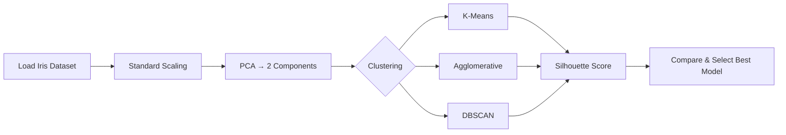

<div align="center">

# 🌸 Iris Species Segmentation
### Unsupervised Clustering with K-Means, Agglomerative Clustering & DBSCAN

[](https://www.python.org/)
[](https://scikit-learn.org/)
[](https://streamlit.io/)
[](#license)
[]()

*Discovering natural groupings in the classic Iris dataset — without ever looking at the labels.*

</div>

---

## 📖 Overview

This project explores **unsupervised clustering** on the famous [Iris dataset](https://archive.ics.uci.edu/dataset/53/iris), comparing three popular algorithms:

| Algorithm | Type | Key Idea |
|---|---|---|
| 🟦 **K-Means** | Centroid-based | Partitions data into `k` clusters by minimizing within-cluster variance |
| 🟩 **Agglomerative Clustering** | Hierarchical | Iteratively merges the closest pairs of points/clusters bottom-up |
| 🟥 **DBSCAN** | Density-based | Groups points by density, automatically flagging outliers as noise |

Each model is trained on a **PCA-reduced, standardized** version of the data and evaluated with the **Silhouette Score** — a metric that quantifies how well-separated and cohesive the resulting clusters are.

> 🎯 **Goal:** Determine which clustering technique best recovers the natural structure of the Iris dataset *without using the species labels.*

---

## 🗂️ Table of Contents

- [Dataset](#-dataset)
- [Pipeline](#-pipeline)
- [Results & Visualizations](#-results--visualizations)
- [Final Comparison](#-final-comparison)
- [Conclusion](#-conclusion)
- [Project Structure](#-project-structure)
- [Getting Started](#-getting-started)
- [Streamlit App](#-streamlit-app)
- [Tech Stack](#-tech-stack)
- [License](#-license)

---

## 🌼 Dataset

The **Iris dataset** contains 150 samples of iris flowers across 3 species (*setosa*, *versicolor*, *virginica*), described by 4 features:

- Sepal length & width (cm)
- Petal length & width (cm)

<p align="center">
  
</p>

---

## ⚙️ Pipeline



1. **Scale** features with `StandardScaler` so no feature dominates due to units.
2. **Reduce dimensionality** with `PCA` (2 components → **95.8%** of variance retained) for visualization and clustering.
3. **Find optimal `k`** using the **Elbow Method** + `KneeLocator`.
4. **Train** all three clustering algorithms.
5. **Evaluate** with the **Silhouette Score** and visually compare cluster shapes.

---

## 📊 Results & Visualizations

### PCA Projection
2D projection capturing most of the dataset's variance — used as the working space for K-Means and Agglomerative Clustering.

<p align="center">
  
</p>

### Finding the Optimal Number of Clusters
The elbow method confirms **k = 3**, matching the 3 known iris species.

<p align="center">
  
</p>

### 🟦 K-Means Clustering
<p align="center">
  
</p>

> **Silhouette Score: `0.5092`**

### 🟩 Agglomerative Hierarchical Clustering
<p align="center">
  
</p>

> **Silhouette Score: `0.5111`** 🏆 *Best performing model*

### 🟥 DBSCAN
<p align="center">
  
</p>

> **Silhouette Score: `0.3703`** — DBSCAN found 2 dense regions and flagged 34 points as noise/outliers, since two of the iris species (*versicolor* and *virginica*) overlap in feature space.

---

## 🏁 Final Comparison

<p align="center">
  
</p>

| Model | Silhouette Score | Notes |
|---|:---:|---|
| K-Means (k=3) | 0.5092 | Strong, well-balanced clusters |
| **Agglomerative (k=3)** | **0.5111** 🏆 | Best overall separation & cohesion |
| DBSCAN (eps=0.5, min_samples=5) | 0.3703 | Sensitive to density overlap; produces noise points |

---

## ✅ Conclusion

- **Agglomerative Hierarchical Clustering** achieved the highest Silhouette Score (**0.5111**), narrowly outperforming **K-Means** (**0.5092**).
- **DBSCAN** scored lower, struggling with the natural overlap between *versicolor* and *virginica* in feature space.
- 🏆 **Agglomerative Clustering** is selected as the best-performing model for the Iris dataset based on the Silhouette Score.

---

## 📁 Project Structure

```
iris-clustering/
├── assets/                       # Generated plots & metrics used in this README
│   ├── 01_original_dataset.png
│   ├── 02_pca_projection.png
│   ├── 03_elbow_method.png
│   ├── 04_kmeans_clusters.png
│   ├── 05_agglomerative_clusters.png
│   ├── 06_dbscan_clusters.png
│   ├── 07_silhouette_comparison.png
│   └── metrics.json
├── generate_assets.py            # Reproduces the analysis & regenerates plots
├── app.py                        # Interactive Streamlit application
├── requirements.txt              # Project dependencies
└── README.md
```

---

## 🚀 Getting Started

### 1. Clone & set up the environment

```bash
git clone https://github.com/<your-username>/iris-clustering.git
cd iris-clustering
python -m venv venv
source venv/bin/activate        # On Windows: venv\Scripts\activate
pip install -r requirements.txt
```

### 2. Reproduce the analysis (optional)

```bash
python generate_assets.py
```

### 3. Launch the Streamlit app

```bash
streamlit run app.py
```

The app will open automatically at **http://localhost:8501**.

---

## 🖥️ Streamlit App

An interactive app lets you explore the clustering pipeline live:

- 🔧 Switch between **K-Means**, **Agglomerative Clustering**, and **DBSCAN**
- 🎛️ Tune each algorithm's hyperparameters with sliders (`k`, `eps`, `min_samples`, linkage, etc.)
- 📈 View the live **PCA scatter plot** colored by predicted cluster
- 📐 See the **Silhouette Score** update in real time
- 📊 Compare all three algorithms side-by-side in a results table
- 📥 Download the clustered dataset as CSV

---

## 🧰 Tech Stack

| Category | Tools |
|---|---|
| Language | Python 3.9+ |
| Data Handling | pandas, NumPy |
| Machine Learning | scikit-learn |
| Visualization | Matplotlib, Seaborn, Plotly |
| Optimal-k Detection | kneed |
| Web App | Streamlit |

---

## 📜 License

This project is licensed under the **MIT License** — feel free to use, modify, and share.

---

<div align="center">

Made with 🌸 and scikit-learn — *exploring structure in data, one cluster at a time.*

</div>
